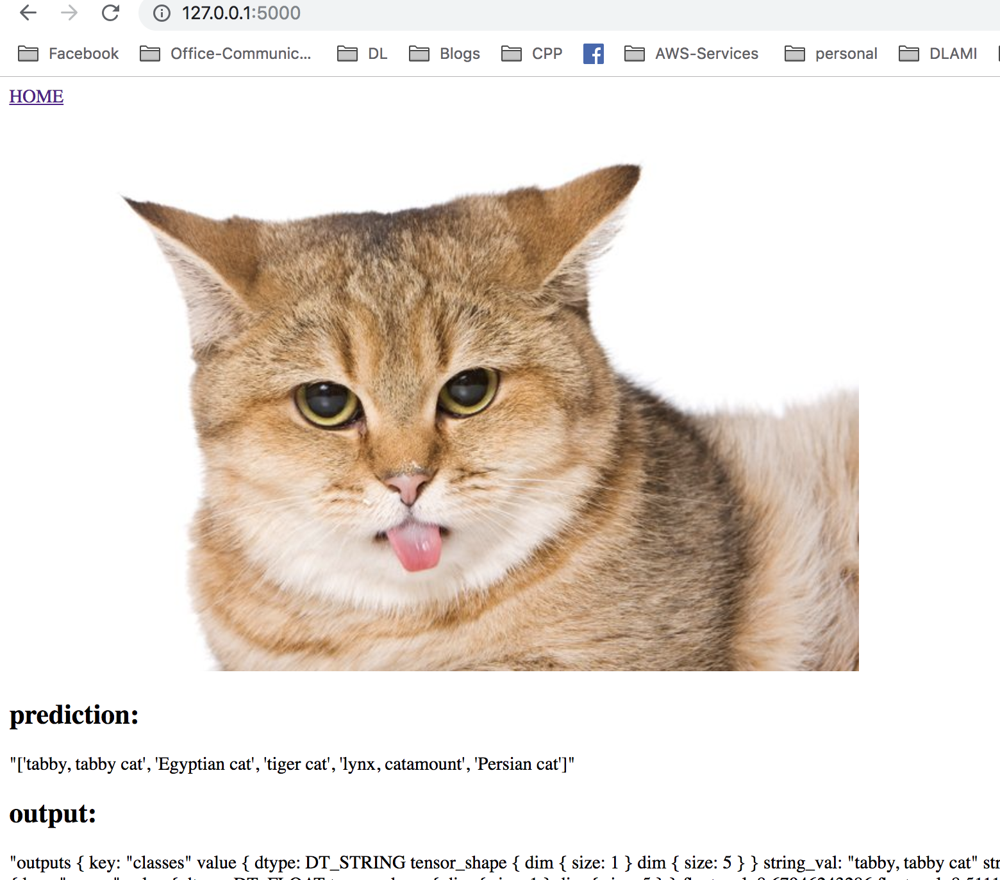

# Inference using TensorFlow and Horovod on Amazon EKS with ImageNet Data

This document explains how to perform inference on Amazon EKS using TensorFlow. 

There are two components needed to perform inference server and client. Following steps will explain both components in detail.

## Prerequisite
1. Create [EKS cluster using GPU](eks-gpu.md)
1. Basic understanding of [TensorFlow Serving](https://www.tensorflow.org/serving/)

## Server 
Server is responsible to run the TensorFlow Model Server. It will load the trained model available in SavedModel format. It basically loads the neural network graph in memory and performs a forward pass on each request to return the output. We will create kubernetes service of type ClusterIP for server. You can create such service by using the file `inference/server/inception_server.yaml`. I've provided a Docker Image for server at `rgaut/inception_serving:final`, however one can build such Docker Image by following the below steps on any machine.

1. Run a Docker with tensorflow and clone serving repo into it
   ```
     docker run -it -v /tmp:/root  tensorflow/tensorflow:1.10.0 bash
     cd /root
     apt-get update && apt-get install git -y
     git clone https://github.com/tensorflow/serving.git
     cd serving
     git checkout remotes/origin/r1.10
     
   ```

1. Link the Inception model to TF Serving code. TF Serving had an [issue](https://github.com/tensorflow/serving/issues/354) related to inception model. Run below command inside the docker container created by `step 1`.
   ```
     cd ~
     git clone https://github.com/tensorflow/models
     ln -s ~/models/research/inception/inception serving/tensorflow_serving/example/inception
     touch serving/tensorflow_serving/example/inception/__init__.py
     touch serving/tensorflow_serving/example/inception/slim/__init__.py
   ```

1. Download the checkpoints of trained inception model on docker container
   ```
     cd /root
     curl -O http://download.tensorflow.org/models/image/imagenet/inception-v3-2016-03-01.tar.gz
     tar xzf inception-v3-2016-03-01.tar.gz
     rm -rf inception-v3-2016-03-01.tar.gz
   ```

1. TF serving model server can only load the model if its in [SavedModel](https://www.tensorflow.org/guide/saved_model) format.Previous steps have performed the setup to convert a Inception model checkpoint to SavedModel. Lets export the checkpoint into SavedModel format. Run below command on docker container 
   ```
     python serving/tensorflow_serving/example/inception_saved_model.py --checkpoint_dir <Directory where the inception model extracted in previous step>  --output_dir /root/inception <Directory where you want to save the exported model> 
   ```
   Provide your `--output-dir` under /root so that it will be saved to your host's /tmp, since we mapped the volume in step 1. You can now exit from tensorflow container. Your SavedModel directory will be available `/tmp/models/inception/`. 

1. Now you have inception model in SavedModel format which can be directly loaded by TF serving. 
   1. Run serving image as deamon 
      ```
        docker run -d --name serving_base tensorflow/serving:1.10.0
      ```

   1. Copy the inception model (SavedModel format) to container's model folder 
      ```
        docker cp /tmp/inception serving_base:/models/inception/
      ```

   1. Commit the container to create an image out of it.
      ```
        docker commit --change "ENV MODEL_NAME inception" serving_base $USER/inception_serving
      ```

        At this point of time you have server image tagged with `$USER/inception_serving` loaded with inception model. 
  
   1. Kill the base serving container 
      ```
        docker kill serving_base
      ```
 
   1. [Test] You have a server image which you can run in back ground and test the inference. To test the inference you will need a picture, a host with TensorFlow install in it as well source code of TF serving. 
      ``` 
        docker run -p 8500:8500 -t $USER/inception_serving & 
      ```

      Now run the inference, lets say you have cat.jpeg picture, python which has TF, TF-Serving-API installed as well TF serving-1.10.0 code base.

      ```
        python serving/tensorflow_serving/example/inception_client.py --server=127.0.0.1:8500 --image=<path to cat.jpeg>     
      ```
      
      it should return output like below along with other information
      ```
        string_val: "Egyptian cat"
        string_val: "tabby, tabby cat"
        string_val: "Siamese cat, Siamese"
        string_val: "tiger cat"
        string_val: "window screen"
      ```

1. At this point of time you can create a ClusterIP kubernetes service using the Docker Image which will serve the inception model by running below command. I've 
      ```
        kubectl create -f inference/server/inception_server.yaml
      ```
      
      This will create a deployments with 3 replicas which will be frontend by ClusterIP service only accessible within the Kubernetes cluster.
  
## Client
   As you notice in the `Test` section of `Server` a client needs to have TensorFlow, TF-Serving-APIinstall as well as TF serving code base. We have added a Dockerfile available at `infernece/client/Dockerfile` which has all these pre-installed. It also has a flask based web server running which will server a simple html page to upload the image and display the output of inference along with uploaded image. 
 
   By using above Dockerfile (or using rgaut/inception_client:final) one can create a kubernetes serving of loadbalancer type by running below command.
   ```
     kubectl create -f inference/client/inception_client.yaml
   ```

## Running the inference 
   After successfully creating the client and server services, you should get the client service external ip along with port by running below command. 
   ```
     kubectl get service inception-client-service -o wide
   ```
   goto your browser and type the EXTERNAL-IP:PORT, you should see below page
   
   
   feel free to upload an image, once you hit on `upload`, you should see page like below.
   

   In case if the page is not accessible due to VPN issue, use port forwarding
   ```
   kubectl port-forward deployment/inception-client-deployment 5000:5000 
   ```
   

