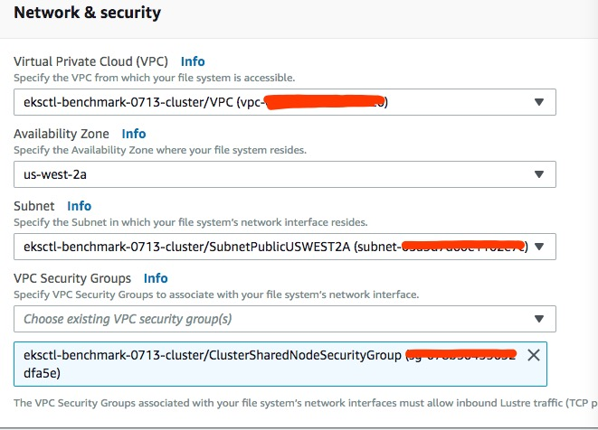
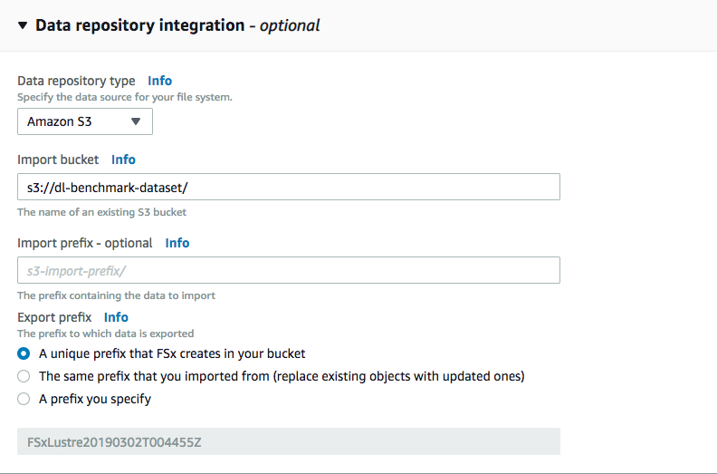

# Distributed Training using TensorFlow and Horovod on Amazon EKS with ImageNet Data

This document explains how to perform distributed training on [Amazon EKS](https://aws.amazon.com/eks/) using TensorFlow and [Horovod](https://github.com/uber/horovod) with [ImageNet dataset](http://www.image-net.org/). The following steps can be ued for any data set though.

## Pre-requisite

1. Create [EKS cluster using GPU with Kubeflow](../../eks-gpu.md).

1. Download and put prepare ImageNet dataset in your S3 bucket like this.

  ```
  ➜ aws s3 ls s3://eks-dl-benchmark/imagenet/train/
  2019-02-28 12:03:46   56755552 train-00001-of-01024
  2019-02-28 12:03:45   56365180 train-00002-of-01024
  ......
  2019-02-28 12:03:45   56365180 train-01024-of-01024


  ➜ aws s3 ls s3://eks-dl-benchmark/imagenet/validation/
  2019-02-28 12:14:10   19504012 validation-00001-of-00128
  2019-02-28 12:14:10   19624967 validation-00002-of-00128
  ....
  2019-02-28 12:14:10   20063161 validation-00128-of-00128
  ```

  The bucket name can be different but all data needs to be in the `imagenet` folder. The training data needs to be in the `train` sub folder and validation data in the `validation` sub folder.

1. Create an [FSX For Lustre](https://aws.amazon.com/fsx/lustre) filesystem and enable data integration with S3. Use the VPC info of the GPU-powered EKS cluster created in the first step to create FSX. Note down the file system id after FSX for Lustre is created.

  > Note: FSX can only mount to one AZ. Make sure to create a single-AZ EKS cluster. This is specified in the `aws_config/cluster_config.yaml` file during cluster creation.

  

  

## Steps

1. Follow [steps](tensorflow-horovod-synthetic.md#install-mpi-operator) to install mpi-operator.

1. Deploy the [Amazon FSx CSI Plugin](https://www.kubeflow.org/docs/aws/storage/#deploy-the-amazon-fsx-csi-plugin).

  ```
  cd ${KUBEFLOW_SRC}/${KFAPP}/ks_app
  export COMPONENT=aws-fsx-csi-driver
  ks generate aws-fsx-csi-driver ${COMPONENT}
  ks apply default -c ${COMPONENT}
  ```

1. Prepare Persistent Volumne (PV), Persistent Volume Claim (PVC) and Storage Class. Go to FSX console and replace `fsxId` and `dnsName` with your FSx info.

  ```
  cd ${KUBEFLOW_SRC}/${KFAPP}/ks_app
  export COMPONENT=fsx-static-storage

  ks generate aws-fsx-pv-static ${COMPONENT} --fsxId=fs-048xxxx7c25 --dnsName=fs-048xxxx7c25.fsx.us-west-2.amazonaws.com

  ks apply default -c ${COMPONENT}
  ```

1. Prepare training job. Check [here](tensorflow-horovod-synthetic.md#launch-mpi-training-job) for more details

  ```
  export JOB_NAME=tf-resnet50-horovod-job
  ks generate mpi-job-custom ${JOB_NAME}

  ks param set ${JOB_NAME} image "seedjeffwan/eks-dl-benchmark:cuda10-tf1.13.1-hvd0.16.0-py3.5"
  ks param set ${JOB_NAME} replicas 2
  ks param set ${JOB_NAME} gpusPerReplica 4

  EXEC="mpirun,-mca,btl_tcp_if_exclude,lo,-mca,pml,ob1,-mca,btl,^openib,--bind-to,none,-map-by,slot,-x,LD_LIBRARY_PATH,-x,PATH,-x,NCCL_DEBUG=INFO,python,models/resnet/tensorflow/train_imagenet_resnet_hvd.py,--batch_size=256,--model=resnet50,--num_batches=300,--fp16,--display_every=50,--lr_decay_mode=poly,--data_dir=/data/imagenet/train"
  ```

  > NOTE: Instead of using synthetic data, job will read from `--data_dir`.

1. Deploy training job

  ```
  ks apply default -c ${JOB_NAME}
  ```

1. Check pod status and logs

  ```
  POD_NAME=$(kubectl -n kubeflow get pods -l mpi_job_name=${JOB_NAME},mpi_role_type=launcher -o name)

  kubectl -n kubeflow logs -f ${POD_NAME}
  ```

  Here is a [sample output](logs/tensorflow-horovod-imagenet-log.txt).

## Appendix

### Download and Pre-process ImageNet Data

If you work for Amazon, then reach out to the authors of this document to have access to the data. Otherwise, follow the instructions below.

1. Download [ImageNet](http://image-net.org/download-images) dataset and upload to your S3 bucket. Use `Download Original Images (for non-commercial research/educational use only)` option.

2. TensorFlow consumes the ImageNet data in a specific format. You can preprocess them by downloading and modifying the script:

    ```
    curl -O https://raw.githubusercontent.com/aws-samples/deep-learning-models/master/utils/tensorflow/preprocess_imagenet.sh
    chmod +x preprocess_imagenet.sh
    ```

    The following values need to be changed:

    * `[your imagenet account]`
    * `[your imagenet access key]`
    * `[PATH TO TFRECORD TRAINING DATASET]`
    * `[PATH TO RESIZED TFRECORD TRAINING DATASET]`
    * `[PATH TO TFRECORD VALIDATION DATASET]`
    * `[PATH TO RESIZED TFRECORD VALIDATION DATASET]`

    Execute the script:

    ```
    ./preprocess_imagenet.sh
    ```
