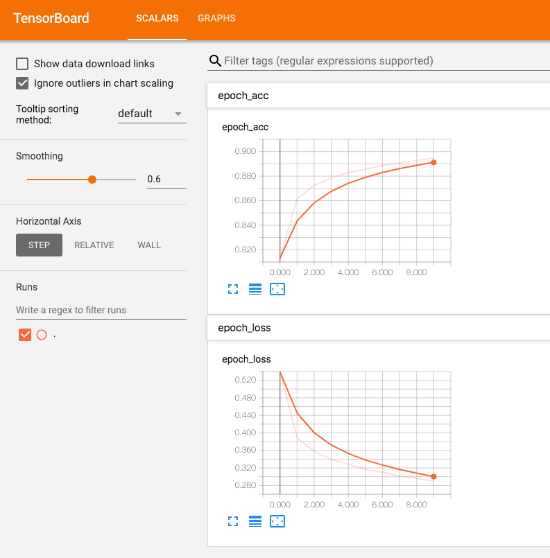
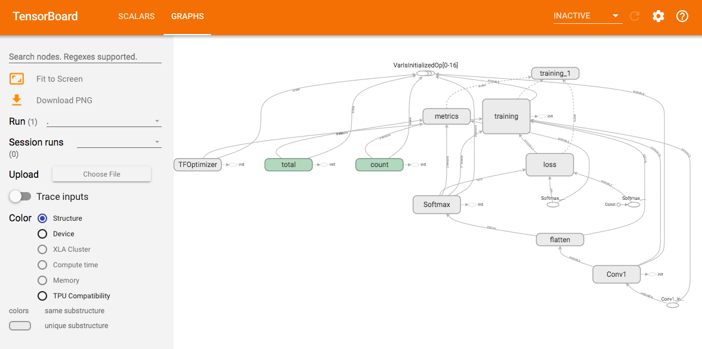

# TensorBoard setup on Amazon EKS

[TensorBoard](https://www.tensorflow.org/guide/summaries_and_tensorboard) helps visualize your TensorFlow graph, plot quantitative metrics about the execution of your graph, and show additional data like images that pass through it.

This document explains how to setup TensorBoard on Amazon EKS.

## Pre-requisite

1. Create [EKS cluster using GPU](eks-gpu.md)
1. Setup [Kubeflow](kubeflow.md)
1. Setup [AWS credential](aws-creds-secret.md) in Kubernetes cluster in `kubeflow` namespace. The exact command would be:

   ```
   kubectl create -f aws-creds-secret.md -n kubeflow
   ```

## Steps

1. Change `your_bucket` to match the name of S3 bucket where model and logs are saved. This is the same bucket that you would've specified during [MNIST Training](mnist/training/tensorflow.md).

   Install TensorBoard jsonnet package:

   ```
   # Navigate to ksonnet application folder
   cd ${KUBEFLOW_SRC}/${KFAPP}/ks_app

   export TENSORBOARD_COMPONENT=tensorboard-mnist
   ks pkg install kubeflow/tensorboard
   ks generate tensorboard-aws ${TENSORBOARD_COMPONENT}

   # configure tensorboard log path
   ks param set ${TENSORBOARD_COMPONENT} defaultTbImage tensorflow/tensorflow:1.12.0
   ks param set ${TENSORBOARD_COMPONENT} logDir s3://your_bucket/mnist/summary/

   # configure region and bucket
   ks param set ${TENSORBOARD_COMPONENT} s3Enabled true
   ks param set ${TENSORBOARD_COMPONENT} efsEnabled false
   ks param set ${TENSORBOARD_COMPONENT} s3AwsRegion us-west-2
   ks param set ${TENSORBOARD_COMPONENT} s3Endpoint s3.us-west-2.amazonaws.com

   # configure aws credential
   ks param set ${TENSORBOARD_COMPONENT} s3SecretName aws-secret
   ks param set ${TENSORBOARD_COMPONENT} s3SecretAccesskeyidKeyName AWS_ACCESS_KEY_ID
   ks param set ${TENSORBOARD_COMPONENT} s3SecretSecretaccesskeyKeyName AWS_SECRET_ACCESS_KEY

   # create tensorboard deployment and service
   ks apply default -c ${TENSORBOARD_COMPONENT}
   ```

1. It will create a deployment which runs the TensorBoard on event files. A service is also created so that user can access TensorBoard via browser:

   ```
   kubectl port-forward svc/${TENSORBOARD_COMPONENT} 9000:9000 -n kubeflow
   ```

   This image shows that the accuracy is improving and loss is reducing as the number of epochs increase.

   

   This image shows TensorBoard computational graphs.

   

